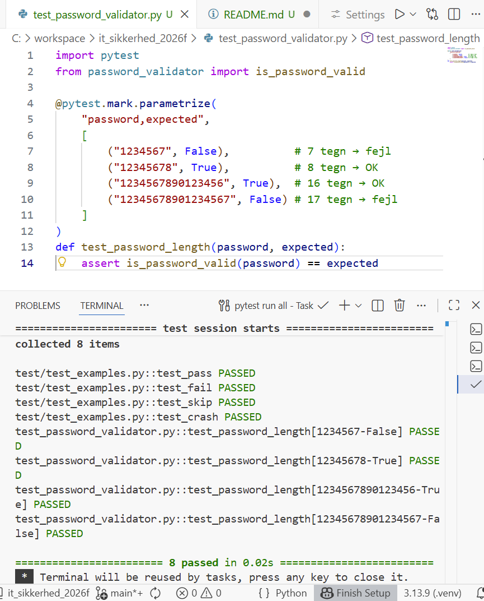
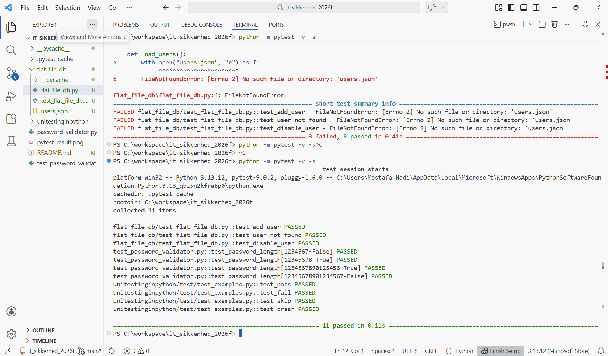
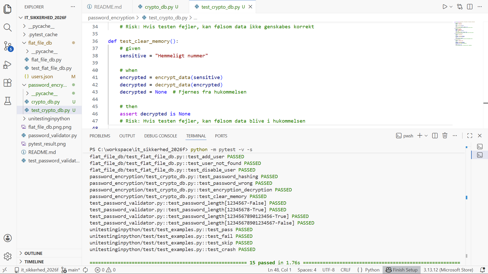

# it_sikkerhed_2026f
Dette er et skoleprojekt på Zealand 

def test_pass():
    # Denne test vil passere
    assert 1 + 1 == 2

def test_fail():
    # Denne test vil fejle
    assert 1 * 1 == 1

# @pytest.mark.skip(reason="Springes over med vilje") # Denne test bliver slet ikke kørt
def test_skip():
    assert True # failed test bliver ignoreret
   # raise RuntimeError("Test crashede med vilje") # crash bliver også ignoreret

def test_crash():
    # Denne test crasher med en exception
    assert True
   # assert False # failed test bliver ignoreret

Dato: 05/02/2026
Opgave: (Test) Teknikker

Dette repository forklarerer anvendelsen af testteknikker med password-validering i fokus. 

Krav til password: 1. Passwordlængde: mellem 8-16. Mindre end 8 karakterer --> fej. Mere end 16 karakterer --> fejl 
____________________________________________________
# Ækvivalensklasser:

| Klasse | Længde    | Forventet resultat |
|--------|-----------|--------------------|
| 1      | 0-7 tegn  | afvist             |
| 2      | 8-16 tegn | godkendt           |
| 3      | 17+ tegn  | afvist             |

Security gate: Code / Dev gate (input validation)
__________________________________________________
# Grænseværditest:

| Test | Input    | Forventet  |
|------|----------|------------|
| 1    | 7 tegn   | afvist     |
| 2    | 8 tegn   | godkendt   |
| 3    | 16 tegn  | godkendt   |
| 4    | 17       | afvist     |

Security gate: Code / Dev gate
_________________________________________________
# CRUD – Password-håndtering
+-----------+----------------------------------+
| Operation | Beskrivelse                      |
+-----------+----------------------------------+
| Create    | Opret bruger med password        |
+-----------+----------------------------------+
| Read      | Verificer at password eksisterer |
+-----------+----------------------------------+
| Update    | Skift password                   |
+-----------+----------------------------------+
| Delete    | Slet bruger og password          |
+-----------+----------------------------------+
| Lock      | Lås konto ved gentagne fejl      |
+-----------+----------------------------------+

Security gate: Integration security gate
__________________________________________________
# Cycle Process Test
Scenario: Gentagne login forsøg

1. Forkert password 
2. Gentag processen flere gange 
3. Konto låses 
4. Konto nulstilles 
5. Login med korrekt password 

Forventning: Systemet håndterer gentagelser rigtigt uden datatab. 

Security gate: system security gate 
______________________________________________________
# Testpyramiden
- Unit tests: password-længde validering 
- Integration tests: Login + database 
- System: Brugerlogin flow 

Security gate: Alle gates afhængigt af niveau 
________________________________________________________

Pytest 
import pytest

@pytest.mark.parametrize(
"password,expected",
[
("1234567", False),
("12345678", True),
("1234567890123456", True),
("12345678901234567", False),
]
)
def test_password_length(password, expected):
assert is_password_valid(password) == expected

# Pytest (password validator) testresultat

________________________________________________________

Dato: 10/02/2026 
Opave: Flat File 

Databasen er implementeret som en JSON-fil (`users.json`),
der fungerer som en brugerdatabase.

# Hver bruger består af følgende felter:
- person_id
- first_name
- last_name
- address
- street_number
- password
- enabled

Databasen tilgås via Python-kode, der kan læse fra og skrive til JSON-filen.

# Funktionalitet
Den implementerede flat file database understøtter følgende funktioner:
- Oprettelse af nye brugere
- Søgning efter brugere via person_id
- Deaktivering af brugere
- Håndtering af tilfælde, hvor en bruger ikke findes

# Test design
Testene er designet ved brug af test design teknikker såsom:
- Positive tests (gyldige input)
- Negative tests (ugyldige input)
- Boundary tests (grænseværdier)

Testene er skrevet som unit tests ved brug af pytest
og anvender strukturen given / when / then.

# Risici ved fejlede tests
Hvis testene ikke består, kan det medføre følgende risici:
- Brugere kan ikke oprettes korrekt
- Systemet kan returnere forkert brugerdata
- Deaktiverede brugere kan stadig være aktive
- Sikkerhedsproblemer i adgangskontrol

Derfor er unit tests nødvendige for at sikre korrekt funktionalitet.

# Screenshot af testresultat 

___________________________________________________________
Dato: 10/02/2026 
Opgave: Kryptering & Hashing 

# Lidt teori
For at opfylde GDPR og sikre password-sikkerhed, bruger vi: 
1. Hahsing af passwords (bcrypt). Denne metode er sikker og passwords kan ikke dekrypteres. 
2. Kryptering af følsomme data (Fernet). Denne metode krypterer følsomme data med nøgle, og data dekrypteres ikke når det skal bruges. 

- Kryptering: Før der gemmes følsomme data i database. 
- Dekryptering: Når data skal bruges i et program. 

# Test 
- Hashing af password (korrekt og forkert)
- Kryptering og dekryptering af følsom data
- Fjernelse af dekrypteret data fra hukommelsen

Screenshots af beståede tests er vedlagt.

# Risici
- Passwords kan ikke verificeres, hvis hash fejler  
- Følsom data kan ikke genskabes, hvis kryptering/dekryptering fejler  
- Følsom data kan ligge i hukommelsen, hvis det ikke fjernes korrekt

# Testresultat - Screenshot 

